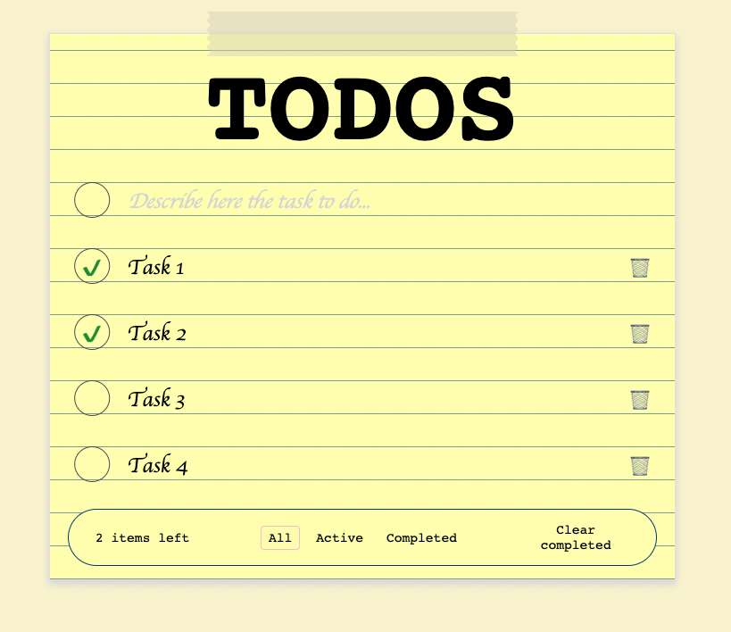

# TODO List Manager

This project defines a user interface for managing a TODO list.

## Development

This project was developed using TDD approach - all of the tests had been written, then the UI had been tested as well.

This project can be started using the script `npm run start:dev`.

## Tests

Tests for the project could be start using the script `npm run test`.

## Linting and formatting

For linting and formatting, the following scripts could be used: `npm run lint` and `npm run format`.

## Usage example

